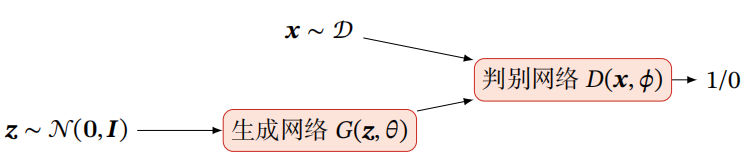

# GAN-INTRO
GAN 就完了 ！

### 什么是GAN ？

**GAN：** 是通过**对抗训练**的方式来使得**生成网络产生的样本**服从**真实数据分布**。而其网络的关键在于**生成网络**和**判别网络**的对抗学习。

- **判别网络** ，目标是尽量准确地判断一个样本是来自于真实数据还是由生成网络产生；
- **生成网络** ，目标是尽量生成判别网络无法区分来源的样本。

这两个目标相反的网络不断地进行交替训练。 当最后收敛时，如果判别网络再也无法判断出一个样本的来源，那么也就等价于生成网络可以生成符合真实数据分布的样本。

### GAN思路 ？ ？

直观的来讲可以把**生成网络**想象为一位莫奈风格的**名画伪造者**，把**判别网络**当作一位莫奈风格的**艺术鉴定师**。 整个训练的过程可以理解为伪造者和鉴定师不断学习成长的过程，主要流程如下：

- 一开始，**伪造者**是个刚入门的小白，网络中的参数都是随机初始化的，因此只会在画布上画出混乱的颜色；
- 之后他将**自己的一些作品**和莫**奈风格的真品**混在一起，请**艺术鉴定师**进行真实性评估；
- **艺术鉴定师**通过真实的数据集学习，一开始很容易鉴别出了赝品，并**向伪造者反馈**告诉他哪些看起来像真迹、哪些看起来不想真迹。
- **伪造者**根据这些**反馈**，**改进**自己的赝品。

### GAN网络结构 ？

GAN从网络的角度来看，它由**两部分**组成。

- **生成器网络**：它一个潜在空间的随机向量作为输入，并将其解码为一张合成图像。
- **判别器网络**：以一张图像（真实的或合成的均可）作为输入，并预测该图像来自训练集还是来自生成器网络。

### 损失函数 ？ Loss Function

从GAN的架构图可知，控制生成器或判别器的关键是**损失函数**，而如何定义损失函数就成为整个GAN的关键！！

我们的目标是既要不断**提升判断器辨别是非或真假的能力**，又要不断**提升生成器不断提升图像质量**，使判别器越来越难判别。

### 符号说明

| 符号       | 说明                                                         |
| ---------- | :----------------------------------------------------------- |
| x          | 输入到某个网络的样本（比如说一张图）                         |
| y          | 样本标签，真实为1，生成样本为0                               |
| θ          | 生成网络参数                                                 |
| ϕ          | 判断网络参数                                                 |
| z          | 低维空间z中的一个样本（一个低维tensor）                      |
| pr(x)      | x来自于真实分布的概率                                        |
| pθ(x)      | x来自于生成模型的概率                                        |
| P(z)       | 低维空间 𝒵 中的一个简单容易采样的分布，通常为标准多元正态分布N(0, 1) |
| G(**z**;θ) | 将低维tensor  z 输入到参数为 θ 的生成网络中，得到一个虚假的生成样本（可以理解为一张图画） |
| D(**x**;ϕ) | 将样本 𝒙 输入到参数为 ϕ 的判别网络中，得到一个是否为真样本的概率 |

### 判断网络的损失函数 ？

判断网络（Discriminator Network）`D(𝒙; ϕ)` 的目标是区分出一个样本 𝒙  是来自真实分布还是来自于生成模型

实际上就是一个二分类的分类器，

简单来说就是一个分类问题。

判断网络 D(𝒙; ϕ)  的输出是 𝒙 属于真实数据分布的概率：

`P(y=1 | 𝒙 ) = D(𝒙; ϕ)`

那么样本来自于生成模型的概率为：

`P(y=0 | 𝒙 ) = 1 - D(𝒙; ϕ)`

给定一个样本(x, 𝑦)(x,y) , 𝑦 = {1, 0}表示其来自于真实样本还是生成样本，判别网络的**目标函数**为**最小化交叉熵**，即

ϕmin−(E**x**[ylogp(y=1∣**x**)+(1−y)logp(y=0∣**x**)])

假设分布 𝑝(𝒙) 是由分布 p_𝑟(𝒙)pr(**x**) 和分布 p_{\theta}(𝒙)pθ(**x**) 等比例混合而成，即 
$$
p(𝒙) =\frac{1}{2}\left(p_{r}(\boldsymbol{x})+p_{\theta}(\boldsymbol{x})\right)
$$
则上式等价于：

ϕmaxE**x**∼pr(**x**)[logD(**x**;ϕ)]+E**x**′∼pθ(**x**′)[log(1−D(**x**′;ϕ))] = ϕmaxE**x**∼pr(**x**)[logD(**x**;ϕ)]+E**z**∼p(z)[log(1−D(G(**z**;θ);ϕ))]

### 生成网络的损失函数 ？

### 最小化最大化游戏（Minimax Game）

### 训练（Train）

